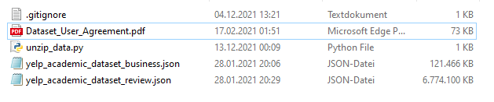

# Yelp Dataset Analysis

This repository contains my analysis of yelp data.

## Setup

You can reproduce the results of this repository in two different ways.

If you want to utilize the full dataset do the following. 
1. Download the yelp dataset
2. Extract the .json files directly into the `/data` directory. It should look like this:

3. run `data/read_data.py`

### Using conda or pip

In case you want to use conda or pip environments, we provided the necessary `environment.yml` and `requirements.txt` respectively.

Please install via `conda env create --file envname.yml` or `pip install requirements.txt`.

Afterwards you can view start the jupyter notebook server via `jupyter notebook` and run the notebooks as you like on your localhost.

### Using the docker container

In case you want to use docker, you can use the attached docker file. When starting the docker container, it will start the jupyter notebook server inside the docker and attach it to your localhost:8888 port. Please make sure that this port is not in use by other applications. If necessary, you can adapt the port inside the docker file.

To start the Docker with the jupyter notebook file, you can `make build` or run the docker command `docker build -t docker_builds/notebook -f Dockerfile.notebook .`

If you want to use the model that was already trained, you can host a flask endpoint with `make build-server` and `make run-server`, in that order. Then, using http requests, you can call the API with a text and receive the star rating for each trained topic as answer.

### Caveats

I ran this task on a laptop with 16 GB of RAM. I don't know, whether it would work on lower scaled machines. This problem could be solved using pyspark and its related packages and relying more on file-based data (see [here](https://databricks.com/de/glossary/pyspark) for more information).

## Task description

I was asked to

- download the [yelp dataset](https://www.yelp.com/dataset/download)
- come up with one or more questions to answer around this dataset
- solve the task using Python or Scala
- make the code available via this Github repository
- explain how to execute the code using docker.
- create a presentation of the results for a technical audience